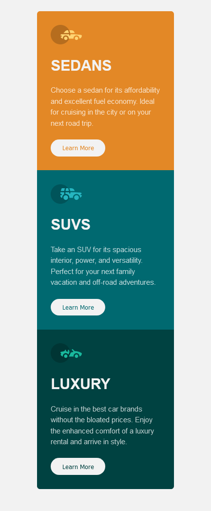

# Frontend Mentor - 3-column preview card componyent solution

This is a solution to the [3-column preview card component challenge on Frontend Mentor](https://www.frontendmentor.io/challenges/3column-preview-card-component-pH92eAR2-) coded by Adebimpe Abdulhamid Eniola. Frontend Mentor challenges help you improve your coding skills by building realistic projects. 

## Table of contents

- [Overview](#overview)
  - [The challenge](#the-challenge)
  - [Screenshot](#screenshot)
  - [Links](#links)
  - [Built with](#built-with)
  - [What I learned](#what-i-learned)
- [Author](#author)

**Note: Delete this note and update the table of contents based on what sections you keep.**

## Overview

### The challenge

Users should be able to:

- interact smoothly depending on the type of device 

### Screenshot
Desktop Design


Mobile Design



### Links

- Solution URL: [Add solution URL here](https://your-solution-url.com)
- Live Site URL: [Add live site URL here](https://your-live-site-url.com)

## My process

### Built with

- Semantic HTML5 markup
- CSS Grid
- Mobile-first workflow


### What I learned

How to properly use position property with css transforms

```css
body {
      position: relative;
      min-height: 100vh;
      width: 100%;
   }

   .container {
      position: absolute;
      width: 71%;
      grid-template-columns: 1fr 1fr 1fr;
      top: 50%;
      left: 50%;
      transform: translate(-50%,-50%);
   }
```

## Author

- Email - adebimpeabdulhamid5@gmail.com
- Frontend Mentor - 
